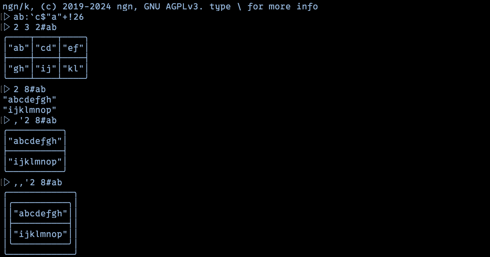
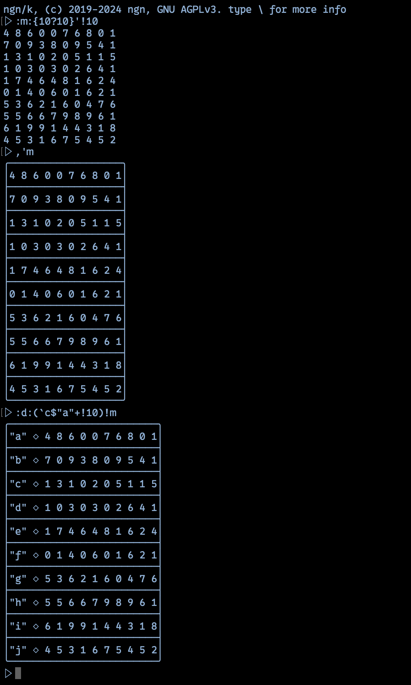
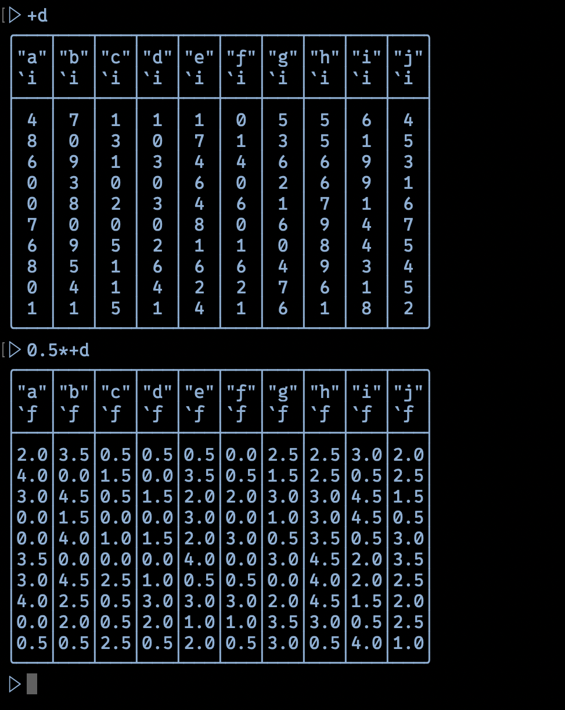
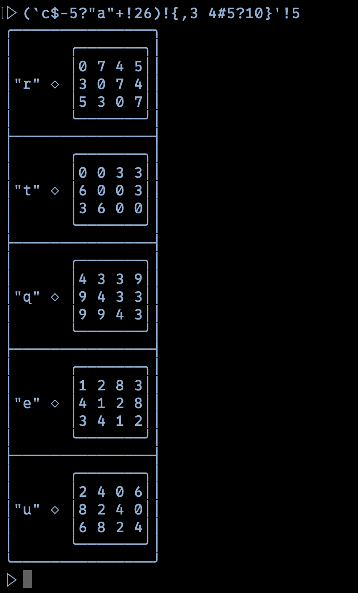
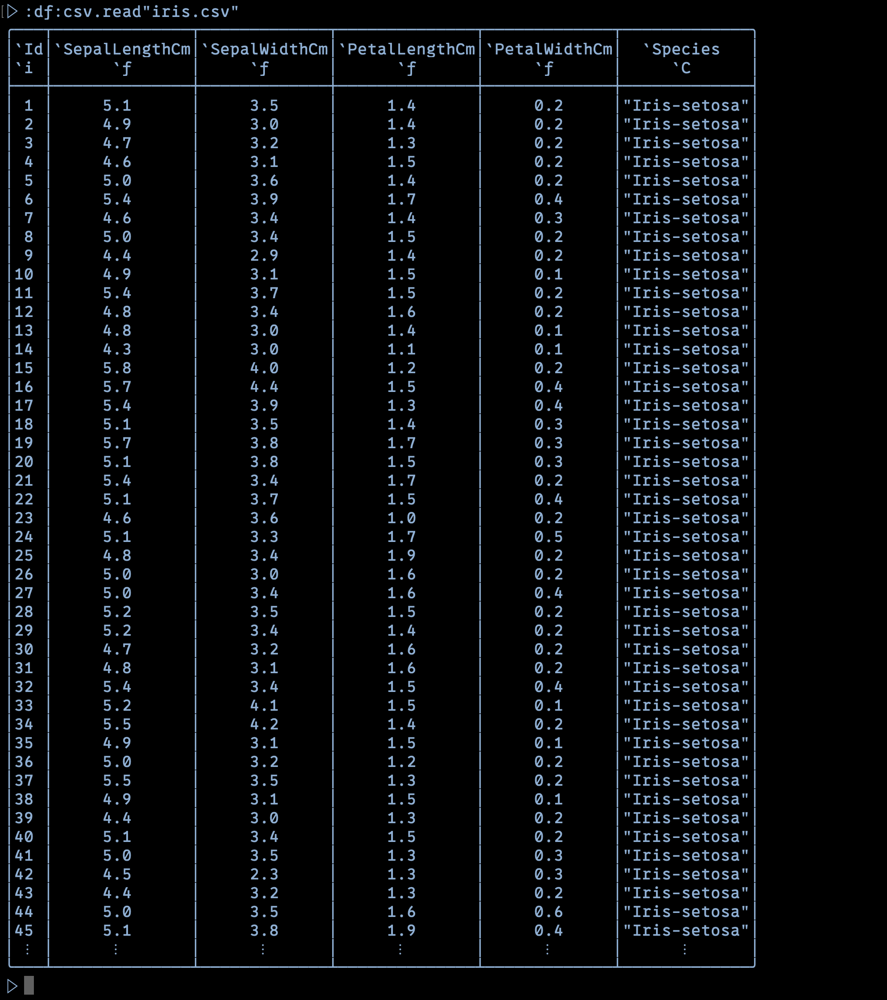
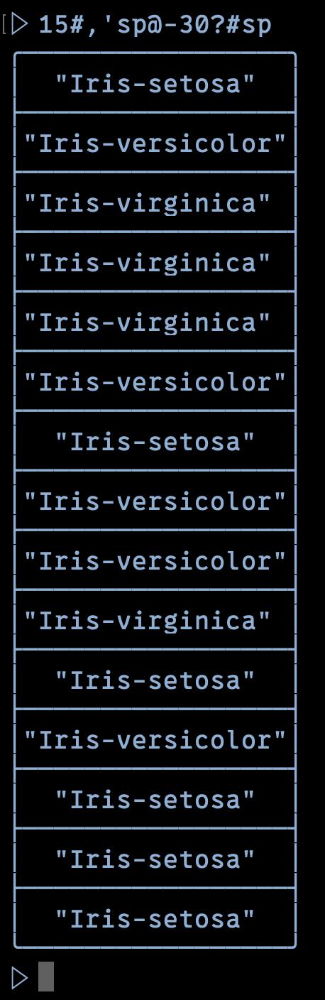
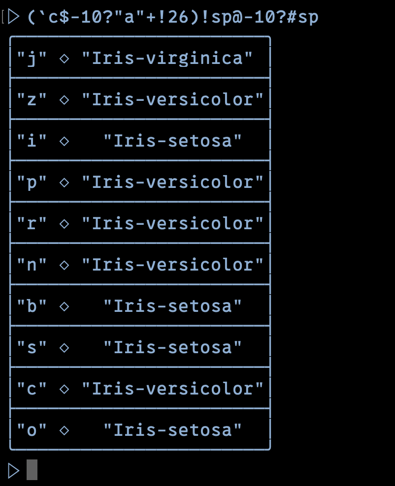
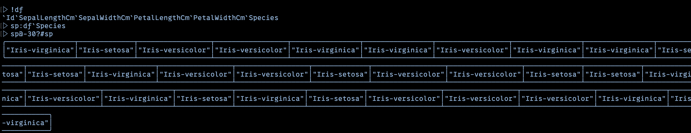
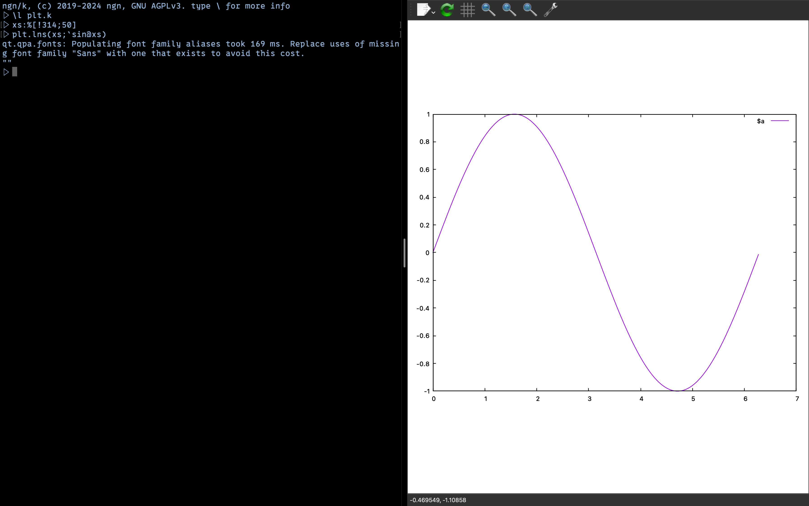
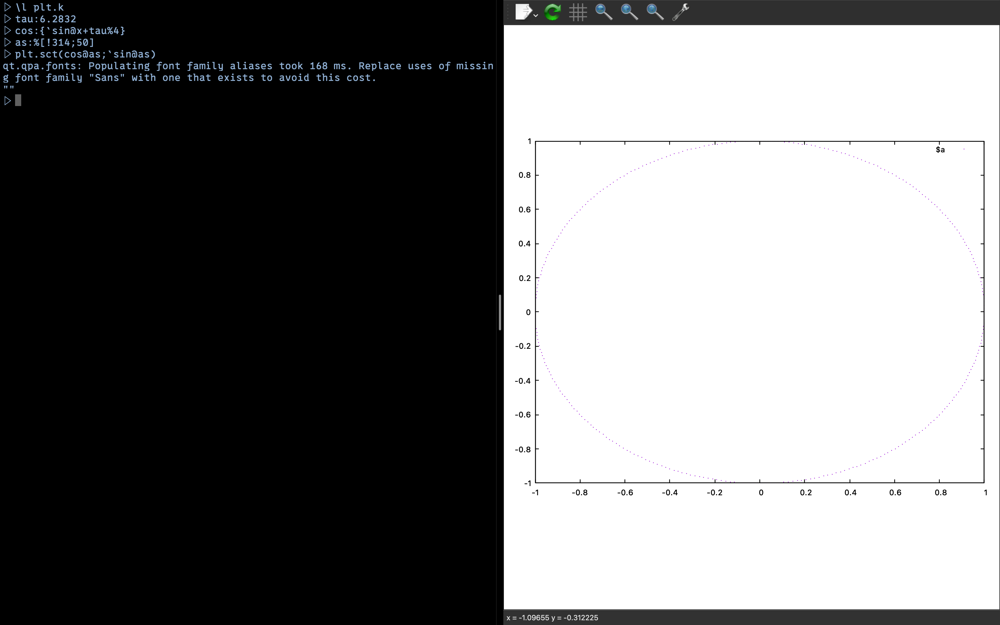

# kutils
This is a set of utilities I started to write for K ([ngn/k](https://codeberg.org/ngn/k)) in order to enhance its practical usability and hopefully make it more useful to who like me likes this great language. It currently consists of:

## box.k
A library heavily inspired to ```]box``` mode from Dyalog APL interpreter and similar ones available for other array languages. I really like the way these utilities let the user look at the data structures in a natural way. Tough ngn/k (repl) has the advantage of showing data structures as valid k code, I like the experiece given by a more intuitive and "graphical" view. The main function is ```box.shw``` which implements rendering for the main structures, id est:
- matrix (box tries to understand where a purely nested array of arrays is to intend as a matrix and do it recursively through the data's structure)
- boxed values
- generic vectors
- dictionaries
- tables (here I get inspiration from the really nice rendering available in the Julia repl for dataframes).

## csv.k
I find ngn/k to be a really practical language to handle and transform data, so a natural tool is a csv reader. ```ngn/k``` is very concise and practical, so it's not an issue opening CSVs. However ```csv.k```, via its main ```csv.read``` function makes the thing smoother. Moreover it tries to understand each column type and do the appropriate casting, returning a nice ```ngn/k``` table.

## plt.k
Handling data one sometimes wants to visualize it, when possible. With this purpose I wrote ```plt.k```, which enables barebone plotting via ```gnuplot``` simply sending it opportune input via command line. Currently ```plt.k``` supports only two plots:
- ```plt.lns``` to show a polygonal line, perfect for simple (one dimensional) functions and curves plotting. It accepts a matrix in the form of ```(xs;ys)```.
- ```plt.sct``` to show a scatter plot. It accepts a matrix in the same format of ```plt.lns```.

## jkl.k
This stands for _jl_ around _k_ (I like the three letters being a contiguous segment of the alphabet) and anable calling julia code and libraries functions (hence potentially python libraries too, via ""PyCall.jl""") from inside ```ngn/k``` in a pretty smooth way. ```jkl.k``` does it by starting an invisible julia session server via ```tmux``` and sending commands to it. Then it reinterpret
the reponses trying to infer the right type (julia has an array model with both flat and nested arrays).
It is still way far from perfect, but definitely usable for calculations involving arrays. However I used it for instance to produce a WAV file from a soundwave producted in ```ngn/k```.
- ```jkl.i``` import a Julia package as a dict of k-callabe functions
- ```jkl.p``` used for putting variables in the server julia server
- ```jkl.e``` execute julia code in the server session. Also useful to get the variables back in ```ngn/k``` from the running julia session.

## repl.k
This is an edited version of standard ```repl.k``` from ```ngn/k```. The main changes from standard ```repl.k``` are:
- it uses ```box.k``` rendering by default
- it enables setting background and foreground colors.

For some libraries the environment variable ```NGNK_DIR``` needs to be setted to the ```ngn/k``` folder path.

# Screenshots

<br>
Matrices, vectors, boxing
---

<br>
Matrices, dicts
---

<br>
Tables
---

<br>
Dicts
---

<br>
csv.k
---

<br>
Column vector
---

<br>
Dict
---

<br>
Splitted vector
---

<br>
Line plot - box.lns
---

<br>
Scatter - box.sct